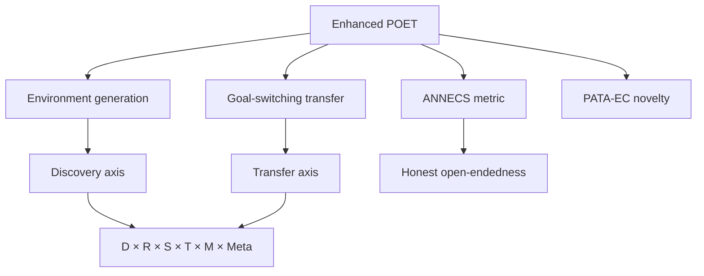

$$
\newcommand{\E}{\mathbb{E}}
$$



## Metadata

| Field | Value |
|---|---|
| Title | Enhanced POET: Open-Ended Reinforcement Learning through Unbounded Invention of Learning Challenges and their Solutions |
| Authors | Wang, Lehman, Rawal, Zhi, Li, Clune, Stanley |
| Venue / Year | ICML 2020 |
| arXiv | 2003.08536 |
| Read on | 2026-05-23 |

## Why this paper?

The honest question behind reading it was not "is open-endedness real?" — it
was *what specifically does open-endedness measure?* Most discussion of
"AI growing up on the internet" collapses into vibes the moment you ask
that. POET is the paper that picks a definition with teeth, ships a metric
to track it (**ANNECS**), and adds a transfer mechanism (**PATA-EC**) that
keeps the search productive rather than ornamental. That is rare enough to
be worth reading slowly.

## The claim, in one sentence

Intelligence-relevant progress is not "solve a fixed benchmark" but
*continually invent, and solve, increasingly hard problems that the system
itself has never seen before* — and that progress is measurable.

## Method

POET runs a *population* of (environment, agent) pairs. Two mechanisms move
them forward:

1. **Environment generation** — environments mutate from existing ones,
   filtered to lie in the "Minimal Criterion" sweet spot (not trivial, not
   impossible) measured by an agent's success.
2. **Goal-switching transfer** — every so often, agents are tested across
   all current environments; if an agent solves an environment better than
   its incumbent, it takes over. Solutions migrate.

Enhanced POET adds two refinements over the 2019 paper
(). First, **PATA-EC** ("Performance
of All Transferred Agents with Elite Catalysts") — a novelty metric that
asks whether a new environment elicits *behaviorally* different agents from
the existing ones, not merely a different difficulty. Second, **ANNECS**
("Accumulated Number of Novel Environments Created and Solved"), the
field's most honest open-endedness metric: it counts environments only when
both *invented* and *eventually solved*, ruling out the easy cheats of
generating gibberish or saturating one niche.

## Key result

In bipedal-walking-style domains, Enhanced POET produces a steadily rising
ANNECS curve over training: a system that keeps *adding* solved-novel
environments at a roughly constant rate, with transfer keeping the
population's solution quality high. The headline is not "agents got
better" — it is "the joint system kept finding new problems worth solving,
indefinitely, under a metric that does not reward stalling."

## Limits — what the paper does *not* show

- The domain is constrained (procedural terrain, fixed action interface).
  POET on "the internet" — a frequent extrapolation — is not what's
  demonstrated.
- ANNECS rewards *novel* + *solved*, which means a system that finds the
  same kind of problem from a slightly different angle still scores; this
  is a feature, but it caps how strong an "open-endedness" claim the metric
  alone can support.
- Compute is non-trivial. The honest reading is "this works because the
  outer-loop sample budget is generous," not "open-endedness is cheap."

## Connection to my own framework

Reading POET twice while writing this entry pushed a framework I had been
circling into a defendable form. It is the closest thing to a real answer
to *what would 'raise an AI like a kid on the internet' actually require?*

**Intelligence = D × R × S × T × M × Meta.**

Each factor is a *real research lineage*, not a coined term:

- **D — Discovery.** Open-ended problem generation; the POET line itself
  (, ),
  Stanley & Lehman's novelty-search line (),
  Schmidhuber's POWERPLAY ().
  This is the axis that says intelligence is not "solve a benchmark" but
  "find the next benchmark worth solving."
- **R — Representation.** Compressing experience into structure;
   as the canonical
  review. This is the axis the LLM literature optimizes.
- **S — Selection.** Optimization pressure; reinforcement learning
  (), free-energy minimization
  (), natural selection.
  This is what RL has owned for decades.
- **T — Transfer.** Generalization across tasks;
   for transferable
  features,  (MAML) for
  meta-learning a transfer prior. POET's goal-switching is this axis built
  into the outer loop.
- **M — Memory.** Persistence and accumulation; external memory
  architectures (), experience
  replay in RL, POET's archive of environments and elites.
- **Meta.** Self-modification *over* D, R, S, T, M. Not a sixth axis but the
  *operator* that changes how the other five behave. POWERPLAY is the
  canonical early instance; MAML is a partial instance (Meta over S only).

The reason POET is more than a single-domain RL result is that it is the
first system to *empirically* couple D and T inside one loop with a
metric (ANNECS) that does not let either axis cheat. Read in that light,
most of the field's progress is one-axis: LLMs push R, RL pushes S,
meta-learning pushes T, memory architectures push M. POET pushes D + T.
Nobody yet pushes the product.



## 5-field card (uniform with the other research posts)

- **Claim:** Open-ended progress = inventing and solving increasingly novel
  problems; measurable via ANNECS.
- **Method:** Population of (env, agent) pairs; environment mutation +
  Minimal Criterion filter; goal-switching transfer; PATA-EC for novelty.
- **Matters:** First operational, measurable definition of open-endedness
  that does not let the system stall or hallucinate progress.
- **Connects to:** The Discovery axis of the D × R × S × T × M × Meta
  framework; ties to transfer via goal-switching.
- **Code:** ✓ — Uber AI Labs released a POET implementation; community
  reimplementations of Enhanced POET exist (verify the specific release you
  use against the paper).

## Mind-map

## Personal insight / critique

The honest probability decomposition the paper invites:

- POET captures a real component of intelligence (the D axis): **~0.55**.
- POET alone is sufficient for general intelligence: **~0.10**.
- D × R × S × T × M × Meta together, if engineered, would suffice: **~0.50**.
- A naive "throw an agent at the internet" reproduces POET-style progress:
  **~0.05** — the internet is not a Minimal-Criterion-filtered environment
  generator, so the loop POET makes work breaks immediately.

The conclusion that follows from those numbers, not from enthusiasm: the
useful version of "raise an AI on the internet" is *not* unsupervised
exposure; it is **turn the internet into a structured evolutionary
landscape with a Minimal-Criterion task generator on top.** POET says that
out loud. Almost no production system does.

The critique direction worth taking from here is Meta. POET modifies D
through environment mutation and T through goal-switching, but the
*rules* of D and T are fixed by the algorithm. A genuinely open-ended
system would let those rules themselves evolve under measured pressure —
which is the line POWERPLAY ()
started decades ago and the field still has not closed.

## Final distillation (3 sentences)

> Intelligence is a system that generates an unbounded stream of novel,
> appropriately-challenging problems and solutions rather than optimizing
> on a fixed dataset.
>
> It builds and refines internal representations, selects effective
> trajectories, transfers knowledge across tasks, and accumulates experience
> over time through interacting processes.
>
> True intelligence emerges when the system modifies these mechanisms
> itself — creating self-generated curricula and evolving its own learning
> dynamics beyond predefined objectives.

## Follow-up reading

- **D (more):**  — the
  early self-improving-loop reference; useful as a sanity check on what
  "Meta over D" actually requires.
- **R (the part POET barely touches):** .
- **T (more rigorous than goal-switching):** .
- **M (the archive question, formalized):** .

## References


