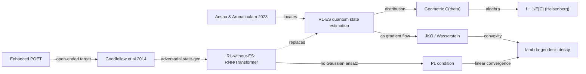

$$
\newcommand{\E}{\mathbb{E}}
\newcommand{\bbR}{\mathbb{R}}
\newcommand{\cP}{\mathcal{P}}
\newcommand{\cF}{\mathcal{F}}
\newcommand{\Wtwo}{W_2}
$$



## Compact map of direct references (top-down)

Read in one breath:

-  — *the* paper. 25 open questions; survey of quantum tomography, physical-state learning, alternative learning paradigms, classical-functions-as-quantum-states.
-  — the ES paper. Black-box, perturbation-based; no policy gradient required.
-  — RL canon. Anchors any policy-gradient comparator.
-  — GAN. Listed here as a direct reference because the *adversarial* generator-discriminator pattern is the natural alternative ansatz family once we drop ES and let an RNN/Transformer parametrise the policy.
-  — Enhanced POET. The Discovery axis of the framework I wrote up in the
  [previous reading-archive entry](); the same paper is the open-ended counterpoint to the closed quantum-state-estimation loop here.
-  — JKO. The proximal-Wasserstein discretisation that makes the gradient-flow analysis in my drafts run.
-  — PL condition. The replacement tool once λ-geodesic-convexity is no longer available.

## Metadata

| Field | Value |
|---|---|
| Title | A Survey on the Complexity of Learning Quantum States |
| Authors | Anshu, Anurag and Arunachalam, Srinivasan |
| Venue | Nature Reviews Physics (invited) — arXiv preprint |
| arXiv | 2305.20069 |
| Read on | 2026-05-26 |

> **Convention used in this entry.** Two registers separated by a divider near the end:
>
> - **Direct** (above the divider) — what the drafts and the advisor feedback commit to: Heisenberg-scaling algebra, Wasserstein–JKO–λ-convexity convergence, the PL-condition pivot once ES is dropped, the controlled RL+ES vs RL-without-ES experiment design. **This is what I am holding until the next iteration.** If it changes later, the revised version will be added *below the divider* in a new dated sub-section, not by rewriting what's above.
> - **Indirect** (below the divider) — my own extensions from reading the survey next to the drafts (cross-framework links, speculative directions). Clearly labelled as mine; not yet locked.

## Why this paper

The paper is not, on its face, about RL or about evolution strategies. It is the most current rigorous map of *what is and is not learnable, and at what sample cost,* for quantum states. Read alongside my own working drafts on RL-ES quantum-state estimation (internal, see *Further notes* below), it does two things at once:

1. It scaffolds the field that any RL-ES quantum-state-estimation method has to be located inside — so that "Heisenberg scaling" is not a slogan but a complexity claim with neighbours.
2. It distils 25 open questions; several of them sit on the same wall the advisor critique on my drafts targets (whether the exponential-decay analysis transfers when ES is removed and an RNN/Transformer takes over the policy).

## Setting

Notation, top-down, math-compact:

- $|\psi\rangle \in \mathbb{C}^{2^n}$: target $n$-qubit state.
- $\hat U(\vec\theta) \in \mathrm{SU}(2^n)$: parametrised circuit, $\vec\theta \in \bbR^d$.
- Measurement success probability: $p_s(\vec\theta) := |\langle s | \hat U(\vec\theta) | \psi \rangle|^2$.
- Success count: $C(\vec\theta) \sim \mathrm{Geom}(p_s(\vec\theta))$, so $\E[C] = p_s/(1-p_s)$.
- Infidelity: $\bar f := 1 - p_s(\vec\theta_{\text{train}}) = 1/(1 + C)$.
- RL-ES sampling: $\vec\theta_i = \vec\theta + \sigma \vec\epsilon_i$, $\vec\epsilon_i \sim \mathcal{N}(0, I)$ — directly .
- Objective: $\tilde J(\vec\theta) = \E[C(\vec\theta)] / C_{\text{target}}$; Monte-Carlo gradient $\nabla\tilde J \approx \frac{1}{k\sigma}\sum_i C(\vec\theta_i)\vec\epsilon_i$.

That is the entire setup the rest of the post analyses.

## Heisenberg-scaling lemma (best paper-ready)

**Definition (Heisenberg scaling).** A protocol achieves *Heisenberg scaling* in $n$ qubits if the achievable variance / infidelity decays as $O(1/n^2)$ rather than the classical (Cramér–Rao) $O(1/n)$.

**Lemma 1 (geometric-distribution Heisenberg form).** Under $C \sim \mathrm{Geom}(p_s)$,
$$
\bar f = \frac{p_s}{\E[C]} \le \frac{1}{\E[C]}
\quad\Longrightarrow\quad
\bar f \in O\!\left(\frac{1}{\E[C]}\right).
$$

*Remark.* This is purely a property of the distributional choice and the algebra of $1-p_s$; it does **not** require RL, ES, or any specific optimiser. The optimiser's job is only to drive $\E[C]$ up. For the entangled-state case with quantum Fisher information $F_Q \sim n^2$ (e.g. GHZ, Dicke; see *Further notes*), saturating the optimal POVM yields $\E[C] \sim n^2$, hence $\bar f \sim O(1/n^2)$.

This separation matters: critiquing "RL-ES achieves Heisenberg scaling" should target whether the *optimisation* delivers the required $\E[C]$ scaling, not whether the algebra is correct. The algebra is fine.

## Wasserstein gradient flow & exponential decay (best paper-ready)

The RL-ES update is most cleanly read as a *parameter-distribution* method, not a parameter-point method. Let $\mu_t := \mathcal{N}(\vec\theta^{(t)}, \sigma^2 I) \in \cP_2(\bbR^n)$, and define
$$
\cF[\mu] := -\int C(\vec\theta)\,d\mu(\vec\theta) = -\E_{\vec\theta\sim\mu}[C(\vec\theta)].
$$

**Theorem (continuous flow).** *The Stochastic-EM / RL-ES update is the Gaussian-family parametrisation of the Wasserstein gradient flow*
$$
\partial_t \mu_t = \nabla \cdot \bigl(\mu_t \nabla C(\vec\theta)\bigr)
\;=\; -\nabla_{\Wtwo} \cF[\mu_t].
$$

**Theorem (JKO discretisation).** *The discrete update*
$$
\mu_{t+1} = \arg\max_{\mu \in \cP_2(\bbR^n)} \left\{ Q(\mu) - \tfrac{1}{2\eta} \Wtwo^{2}(\mu, \mu_t)\right\}
$$
*is the proximal-Wasserstein scheme of*  *applied to $\cF$.*

**Theorem (exponential decay under λ-geodesic convexity).** *If $\cF$ is $\lambda$-geodesically convex on $(\cP_2(\bbR^n), \Wtwo)$, then*
$$
\cF[\mu_t] - \cF[\mu^*] \;\le\; e^{-2\lambda t}\,\Wtwo^{2}(\mu_0, \mu^*),
$$
*and equivalently $\bar f^{(t)} - \bar f^{*} \in O(e^{-\lambda t})$.*

This is the convergence claim the drafts lean on. It is sound *under the convexity hypothesis*. The next two sections are the places that hypothesis cracks.

## Critique 1: the PL-condition pivot when ES is dropped (professor-cautious)

The advisor critique on the drafts can be stated precisely.

The exponential-decay theorem rests on the energy $\cF[\mu] = -\E_\mu[C]$ being **λ-geodesically convex on $\cP_2$ along the Wasserstein metric**. That hypothesis is natural in the RL-ES setting because the ansatz family is Gaussian: $\mu_t$ is parametrised by $(\vec\theta^{(t)}, \sigma^2 I)$, and the gradient-flow trajectory stays inside that family throughout training. Geodesics in $\cP_2$ restricted to Gaussians are well-behaved; verifying $\lambda$-convexity becomes a Hessian-eigenvalue argument on $C(\vec\theta)$ around the optimum.

If we *remove* ES and put an RNN or Transformer in the policy role — sampling actions $a_t \sim \pi_\phi(\cdot \mid h_t)$ from a recurrent/attention-parametrised distribution — the picture shifts in three ways that I want to be explicit about, rather than hiding behind a single inequality:

1. **The ambient measure is no longer Gaussian.** The policy distribution lives in a much larger functional family. The Wasserstein-on-$\cP_2$ argument as stated is for a Gaussian ansatz; transferring it requires either re-doing the geodesic-convexity check on the new family (almost certainly fails) or replacing the convergence tool entirely.

2. **The reward signal is the same geometric $C(\vec\theta)$ — but learned differently.** With ES, the gradient is a covariance-style estimator over Gaussian perturbations. With an RNN/Transformer policy under REINFORCE / actor-critic, the gradient is a score-function estimator over policy entropy. *Same reward distribution, different gradient geometry.* This is the differentiator the advisor flagged.

3. **The right substitute for λ-convexity is the Polyak–Łojasiewicz condition.** The result we want — exponential decay $\|x_t - x^*\| \in O(e^{-\lambda t})$ — survives without convexity if the loss satisfies $\|\nabla \mathcal{L}(x)\|^2 \ge 2\mu(\mathcal{L}(x) - \mathcal{L}^*)$ for some $\mu > 0$. That is the PL condition;  is the modern reference linking it cleanly to linear convergence of gradient and proximal-gradient methods.

This is not an isomorphism. The two convergence stories are different in their assumed structure (geodesic convexity on a metric space of measures vs. a scalar inequality on the loss surface), and the constants $\lambda$ are *not* equal. The honest claim of the RL-without-ES branch is therefore: *if a PL constant $\mu > 0$ can be verified for the loss $-\E_\pi[C]$ as a function of policy parameters, we recover linear convergence in $\bar f$ via the same Heisenberg algebra — but the convergence rate is set by a different, generally weaker, constant.*

There is a real research move here, not just bookkeeping. Verifying PL on a Transformer policy is its own theorem; existing analyses (Karimi–Nutini–Schmidt) cover smooth losses with structural assumptions that overparameterised models often *do* satisfy locally near the optimum. The post does not claim a proof; it identifies the gap.

## Critique 2: the geometric distribution is a memoryless approximation (professor-cautious)

A second, smaller, gap worth naming. The drafts model success counts as $C \sim \mathrm{Geom}(p_s)$, i.e. *memoryless* trials. In real measurement hardware:

- Trials are not strictly i.i.d. — decoherence times, drift, recalibration, and conditional resets introduce trial-to-trial dependence.
- The tail behaviour of the geometric distribution has variance $\mathrm{Var}[C] = (1-p_s)/p_s^2$, which blows up at small $p_s$ — exactly the regime *early training* sits in. The gradient estimator inherits that variance.

The drafts (PDF v2 §3) already propose three modifications — truncated geometric, negative binomial, exponential-family surrogates — that retain the $\bar f \sim 1/\E[C]$ algebra while reducing $\mathrm{Var}[C]$. The honest statement is that the geometric assumption is an *analytical convenience*; the Heisenberg-scaling argument survives swapping it for any distribution whose mean is still proportional to $p_s/(1-p_s)$, and the *convergence-speed* argument actively benefits from doing so.

## Experimental design — RL+ES vs RL-without-ES (best paper-ready)

To contrast the two branches cleanly, the comparator design should fix everything that is not the policy class.

**Controlled axes (held identical):**

- Target state family — start with GHZ$_n$, then Dicke$(N,k)$, then squeezed states, then Haar-random.
- Circuit ansatz $\hat U(\vec\theta)$ — same HEA depth across both branches.
- Reward — geometric success count $C \sim \mathrm{Geom}(p_s)$, with the same hardware/simulator measurement loop.
- Wall-clock and per-shot budget — fixed $N$ total measurements.
- Evaluation metric — $\bar f$ vs $n$ at fixed budget, plus the *convergence curve* $\bar f^{(t)}$ over training.

**Manipulated axis (the comparison):**

- Branch A — **RL-ES**: parameter perturbation $\vec\theta_i = \vec\theta + \sigma\vec\epsilon_i$; Monte-Carlo gradient as in .
- Branch B — **RL-without-ES**: RNN or Transformer policy $\pi_\phi$ producing $\vec\theta$ (or directly the next gate); REINFORCE / actor-critic update on $-\E_\pi[C]$.

**Reported quantities (both branches):**

1. Heisenberg-scaling slope on $\log \bar f$ vs $\log n$ at fixed budget — does $-2$ hold in both?
2. Empirical convergence rate $\lambda_{\text{emp}}$ of $\bar f^{(t)} - \bar f^*$ — does branch B's slope match $\lambda_{\text{PL}}$ inferred from a separate PL-constant estimate on the loss landscape?
3. Variance of the gradient estimator over training — branch A's covariance-style estimator vs branch B's score-function estimator; this is where the geometric-distribution tail bites differently.
4. Robustness slice — repeat with truncated-geometric and negative-binomial reward distributions to check whether the rate-vs-distribution interaction is policy-class-dependent.

The point of the design is *not* to declare a winner; it is to make the PL-vs-λ-convexity gap visible as a slope difference in panel (2) above.

---

# Indirect — my extensions from this reading (not yet locked)

> Everything from here on is my own extension from reading the Anshu–Arunachalam survey alongside the drafts. None of it is committed in the current iteration; treat it as a sketch to revise in the next entry. When the direction below changes, the revised version goes *here*, dated, leaving the Direct section above untouched.

## Connection to D × R × S × T × M × Meta *(indirect — my extension)*

Across to the framework from the [Enhanced POET reading-archive entry](), this paper sits on two axes simultaneously and is the cleanest example I know of where the **Selection (S)** and **Representation (R)** axes are coupled by the same underlying constraint:

- **S — Selection.** RL-ES drives $\E[C]$ upward; ES vs RL-without-ES is *literally* a choice within this axis ( vs ).
- **R — Representation.** The ansatz family $\hat U(\vec\theta)$ — Gaussian-parametric vs RNN/Transformer-parametric — is the representation choice that *also* controls what convergence tool applies (λ-convexity vs PL). This is the kind of axis-coupling the framework predicts.
- **D — Discovery.**  is the relevant counterpoint: there, environment generation drives novelty; here, environment is fixed (the target state) and novelty enters only through the policy class. A POET-style adversarial state generator on top of branch B would be a real D × S × R combination.
- **GAN connection.**  is the natural template if we want an adversarial state generator: discriminator scores how close $|\psi_{\text{est}}\rangle$ is to a target distribution, generator (the RL-without-ES policy) closes the gap. This is a research direction, not a result.

## 5-field card

- **Claim:** The complexity of learning quantum states is a structured field with rigorous bounds; RL-ES quantum-state estimation lives inside it as a *specific optimiser choice* over a specific reward distribution.
- **Method (survey):** Tomography sample-complexity bounds; shadow / classical-shadow models; alternative learning paradigms; classical functions encoded as quantum states; 25 distilled open questions.
- **Matters (for the drafts):** Gives the surrounding wall against which the geometric-count Heisenberg argument and the Wasserstein-gradient-flow analysis can be checked, and against which the RL-without-ES PL-condition pivot has to defend its rate constant.
- **Connects to (direct):**  ES;  PL;  JKO.
- **Connects to (indirect, my extension):** Selection × Representation in the [Enhanced POET framework]();  adversarial state-generation direction.
- **Code:** — (survey paper; no released code).

## Mind-map

*Solid arrows = direct (drafts + advisor feedback). Dotted arrows = indirect (my extensions, in the second half of the post).*

## Further notes (indirect references — pointers, not formal citations)

These are mentioned in passing above and worth following up; they are **not** asserted as load-bearing for any claim and are therefore not in `references.bib` for this post.

- **My own working drafts (unpublished):** *Critique and Idea Proposals on Heisenberg Accuracy in RL-based Quantum State Estimation* — 수학의 즐거움 양자컴퓨팅 팀, v1 and v2 (April–May 2026). v1 lays out the geometric-distribution Heisenberg algebra and the GHZ/Dicke/squeezed comparison; v2 formalises the Wasserstein-gradient-flow and JKO interpretation. Not cited via `` because they are internal notes, not published work; honest framing per the no-fabrication rule.
- **Quantum Fisher Information / quantum Cramér–Rao bound.** The background that makes "Heisenberg scaling" mean something specific. The classical Cramér–Rao bound gives $\mathrm{Var}(\hat\theta) \ge 1/(N \mathcal{I}_{\text{cl}})$; the quantum Cramér–Rao bound replaces $N\mathcal{I}_{\text{cl}}$ with $N^2 F_Q$ for an entangled probe, which is the $1/n^2$ ceiling.
- **Heisenberg-saturating state alternatives.** GHZ$_n$ ($F_Q \sim n^2$, fragile under local noise); Dicke states $|D(N,k)\rangle$ (more robust); spin-squeezed states (Kitagawa–Ueda) and one-axis-twisting / two-axis-countertwisting Hamiltonians. PDF v2 §11 covers these as comparators.
- **PL-condition lineage.** Polyak's original 1963 inequality; the Karimi–Nutini–Schmidt modernisation is the one I'd actually use for the rate calculation. Further reading: invex-function literature, error-bound condition.
- **JKO lineage.** Otto's seminal Wasserstein-gradient-flow work in the early 2000s; Ambrosio–Gigli–Savaré *Gradient Flows in Metric Spaces and in the Space of Probability Measures* is the textbook treatment if a full proof of the $\lambda$-geodesic-convexity theorem is wanted.

## References


