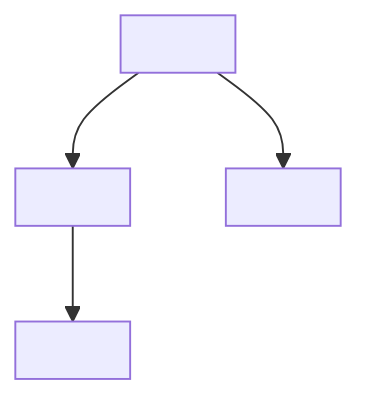

<!--
  TEMPLATE — Reading archive (BOOK variant).
  This file lives outside _posts/ so Jekyll never renders it.
  When the user uploads a book + their notes, copy this to:
      _posts/<YYYY-MM-DD>-<slug>.md
  and fill ONLY user-provided fields. Accuracy rules (from the user, locked):
    * Cover image: only if a real cover URL/file is provided. Otherwise omit the
      figure block entirely (don't fake).
    * Notable quotes: ONLY if the user pasted exact text. Otherwise OMIT the
      whole "Notable quotes" section — never fabricate.
    * Rating / Finished date: include only if user-provided; else omit.
    * Awards, publisher details, reader reviews: never invent.
    * Core concepts + Summary: only from user notes OR well-known content of the
      book. No invented claims.
  Style register (analog reading-archive note): restrained, structured, clean
  headings, no SNS-style emoji or filler. Diagrams via mermaid if useful.
-->
---
layout: post
title: "<TITLE> — <AUTHOR>"
date: <YYYY-MM-DD> <HH:MM:SS>+0900
description: "<one-line motivation in user's own words; omit if not provided>"
tags: reading books <user-tag-1> <user-tag-2>
categories: [reading, books]
related_posts: false
toc:
  sidebar: left
thumbnail: /assets/img/reading-archive/<slug>.png   # delete this line if no image
---

 Cover/hero image — DELETE the next include block if no image. 


## Metadata

| Field | Value |
|---|---|
| Title | <TITLE> |
| Author | <AUTHOR> |
| Category | <literature · investing-strategy · science-history-philosophy-socsci · general nonfiction> |
| Finished | <YYYY-MM-DD>   {# omit row if not provided #} |
| Rating | <user-rating>   {# omit row if not provided #} |

## Why this book?

<motivation in the user's words — REQUIRED. If the user didn't say why, ask before drafting.>

## Core concepts (4–6)

1. <concept 1>
2. <concept 2>
3. <concept 3>
4. <concept 4>
{# add 5–6 only if the book or notes genuinely contain them #}

## Summary

<2–4 short paragraphs synthesizing the user's notes + well-known content of the
book. No invented claims, no invented data.>

## Notable quotes

{# DELETE this whole section if the user didn't paste exact quotes. #}
> "<exact quote, verbatim from user>" — p. <page>

## Personal insight / critique

<user's own thoughts; expand if asked, never invent the user's opinion>

## Core relationship diagram

## Takeaway / memo

- <takeaway 1>
- <takeaway 2>
- Follow-up: <next book / paper to read, if user named one>
