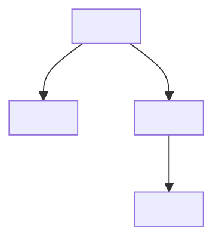

<!--
  TEMPLATE — Reading archive (PAPER variant).
  Same locked accuracy rules as the book variant: no invented citations, venues,
  results, or quotes. Paper variant adds first-class LaTeX (Axis B) — al-folio +
  MathJax already handles \begin{equation}, \eqref, \newcommand, $$…$$, $…$.
  Copy this to:  _posts/<YYYY-MM-DD>-<slug>.md  and fill only user-provided
  fields. If the user gave a paper title or arXiv id, the citation goes into
  _bibliography/references.bib (it is NOT one of the user's own papers — keep
  papers.bib strictly Kim-only).
-->
---
layout: post
title: "<PAPER TITLE> — <FIRST AUTHOR> et al. (<YEAR>)"
date: <YYYY-MM-DD> <HH:MM:SS>+0900
description: "<one-line takeaway in user's own words; omit if not provided>"
tags: reading papers <field-tag>
categories: [reading, papers]
related_posts: false
toc:
  sidebar: left
---

$$
\newcommand{\E}{\mathbb{E}}
$$

## Metadata

| Field | Value |
|---|---|
| Title | <PAPER TITLE> |
| Authors | <Author, A. and Author, B. and ...> |
| Venue / Year | <ICLR 2023 · NeurIPS 2024 · arXiv-only · …> |
| arXiv | <id, e.g. 2305.18290>   {# omit row if none #} |
| Read on | <YYYY-MM-DD>   {# omit row if not provided #} |
| Rating | <user-rating>   {# omit row if not provided #} |

## Why this paper?

<motivation in the user's words — REQUIRED>

## The claim, in one sentence

<the paper's central claim, stated tightly>

## Method

<what the paper actually does — math allowed; cite the paper via  after adding it to references.bib>

$$
\text{(equation block if the paper's central object is mathematical)}
$$

## Key result

<the headline empirical or theoretical result; quote numbers only from the paper>

## Limits / what the paper does NOT show

<honest list of caveats — only those the paper itself notes OR the user pointed out>

## Connection to my own work

<how this touches Kim's tri-system risk model / agent-loop framing, IF it does — leave empty if there's no honest tie>

## 5-field card (uniform with the agent-loop / risk-MC posts)

- **Claim:** …
- **Method:** …
- **Matters:** …
- **Our tie:** …
- **Code:** <repo URL if exists, else "— (no public code)">

## Mind-map

## Personal insight / critique

<user's thoughts; never invent>

## Follow-up reading

- <next paper / book the user named>
